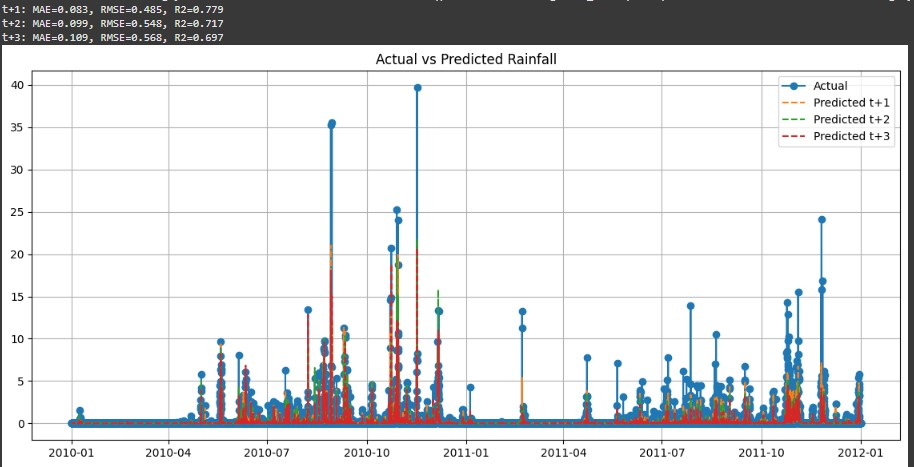
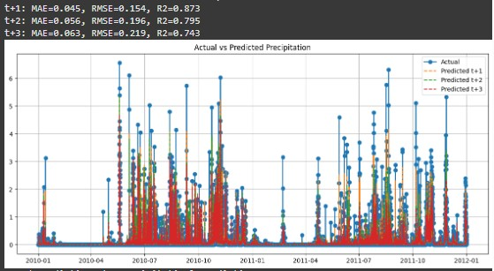
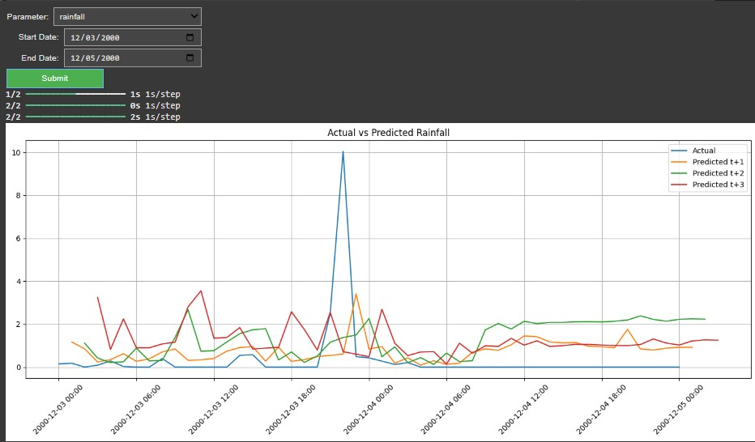
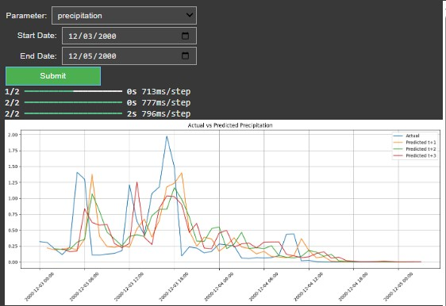
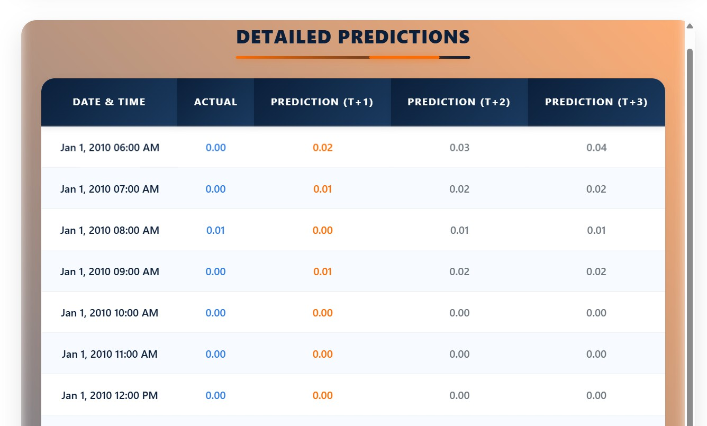

# 🌦 ISRO MAUSAM: Historical Data Weather Visualizer

A Machine Learning and Full Stack Web Application that uses simulated ISRO weather data from **January 1, 2010** to **December 31, 2011** to forecast **rainfall** and **precipitation** for the next 3 hours using the previous 1 hour of data.

## 📖 Overview

This project consists of:
- 🔬 Advanced ML modeling using CNN, LSTM, Random Forest, XGBoost, CatBoost, and LightGBM
- 📈 Predictions for Rainfall and Precipitation
- 🌐 A user-friendly web interface to visualize the predictions interactively
- 📊 RMSE comparison for actual vs. predicted data over different time steps (1hr, 2hr, 3hr)

## 🧠 Machine Learning Pipeline

### 🔨 Model Training

Run:
```bash
python training_cnn_lstm5_rf_xgb_final.py
```

This script combines:
- 🧩 Convolutional Neural Network (CNN) with 30 epochs
- 🔁 Long Short-Term Memory (LSTM) with 5 layers
- 🌲 Random Forest
- 🚀 XGBoost

📊 Also Tested:
- 🧪 CatBoost
- 💡 LightGBM

After 23 different experimental trials, this configuration produced the best results:
- R² score (Rainfall): 0.779
- R² score (Precipitation): 0.873

### 📁 Generated Model Files (Per Category: Rainfall & Precipitation)
Each training session generates:
- `*_robust_scaler.pkl`
- `*_xgb_model_t1.json`
- `*_xgb_model_t2.json`
- `*_xgb_model_t3.json`
- `*_cnn_lstm_feature_extractor.keras`
- `training_*_predictions.csv`

### 🖼️ Training Result Visualizations



### 🔮 Prediction Generation
Run:
```bash
python final_prediction.py
```

This generates predictions for both rainfall and precipitation using the trained models.

#### 📁 Output Files:
Located in the `HTML/` folder:
- `prediction_rainfall_predictions.csv`
- `prediction_precipitation_predictions.csv`

#### 📸 Final Prediction Visualizations



## 🌐 Web Application
Link: [https://682712c9069dda1f3c087666--tranquil-yeot-670bf6.netlify.app/](https://682712c9069dda1f3c087666--tranquil-yeot-670bf6.netlify.app/)

- An interactive web interface lets users:
- Select a date range (between Jan 1, 2010 to Dec 31, 2011)
- Choose to view Rainfall or Precipitation
- Compare actual vs predicted values across:
  - 1-hour
  - 2-hour
  - 3-hour horizons
- View RMSE values to understand forecast accuracy

### 🖼️ Web App Interface Screenshots





## 📁 Project Structure
```
MAUSAM/
├── HTML/
│   ├── prediction_rainfall_predictions.csv
│   └── prediction_precipitation_predictions.csv
├── training_cnn_lstm5_rf_xgb_final.py
├── final_prediction.py
├── Rainfall_Training.jpg
├── Rainfall_Prediction.jpg
├── Precipitation_Training.jpg
├── Precipitation_Prediction.jpg
├── *.pkl, *.json, *.keras        # Trained model files
├── TestDataset.csv
├── images/                       # Web UI screenshots
└── README.md
```

## 🧰 Tech Stack
- **Languages**: Python, HTML, CSS, JavaScript
- **Libraries**: TensorFlow, XGBoost, scikit-learn, Pandas, NumPy
- **Visualization**: Matplotlib
- **Web Hosting**: Netlify

## 🔐 License
```
© 2025 Yoshitha-28

All rights reserved.

Reproduction, redistribution, or use of any code/model/data from this repository is strictly prohibited without prior written permission.
```

## 🙋‍♀️ Author
**Yoshitha-28**  
GitHub: [@Yoshitha-28](https://github.com/Yoshitha-28)
```
